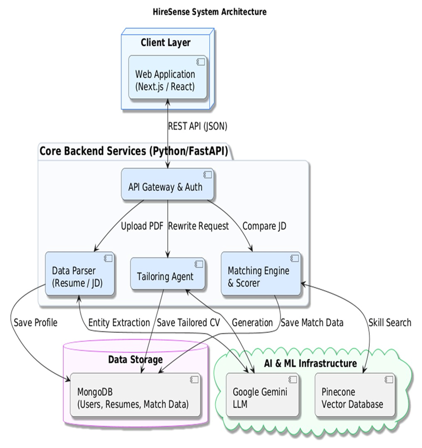
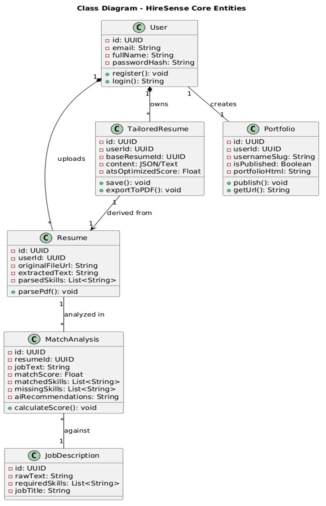
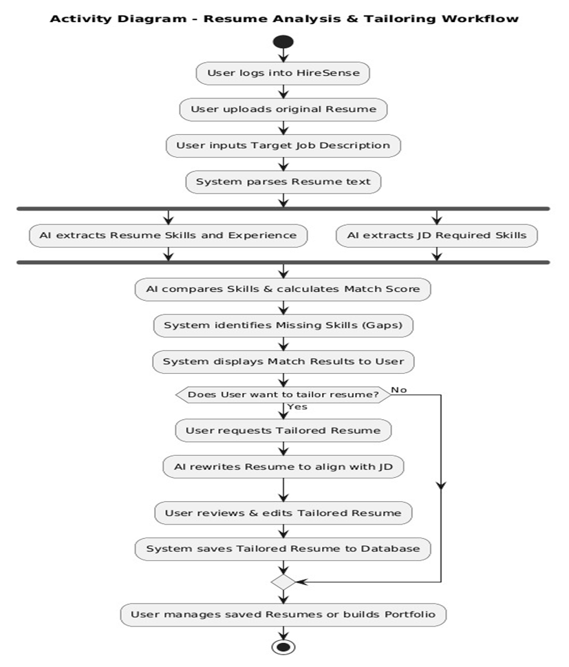
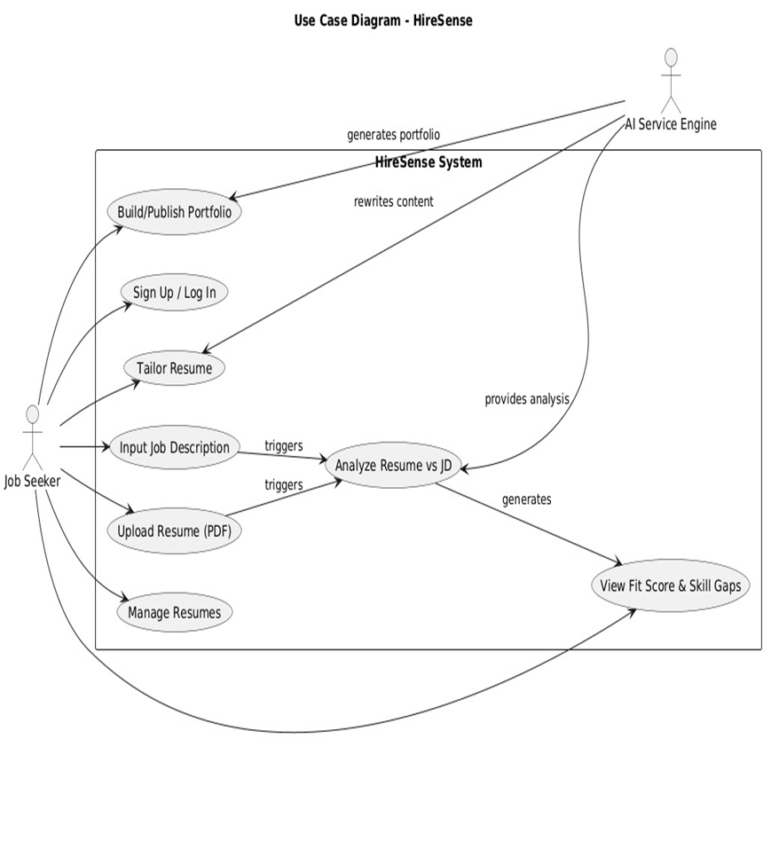
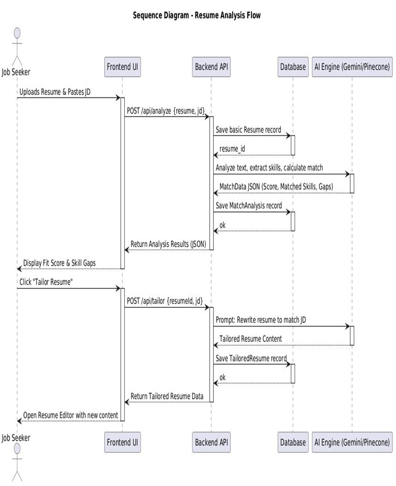
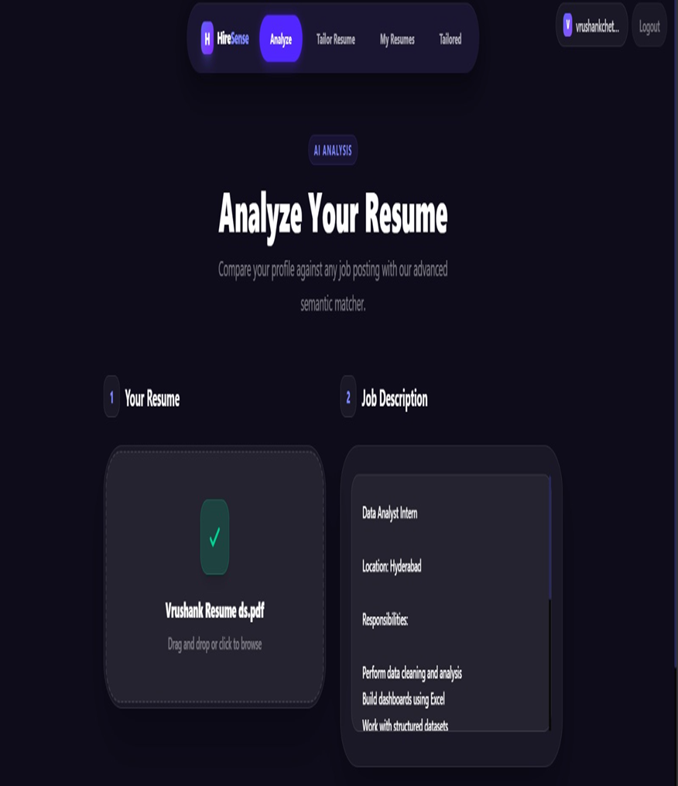
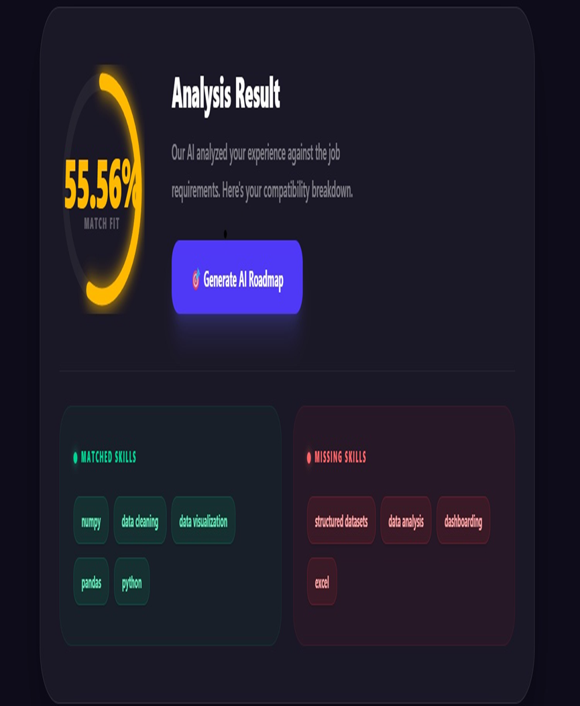
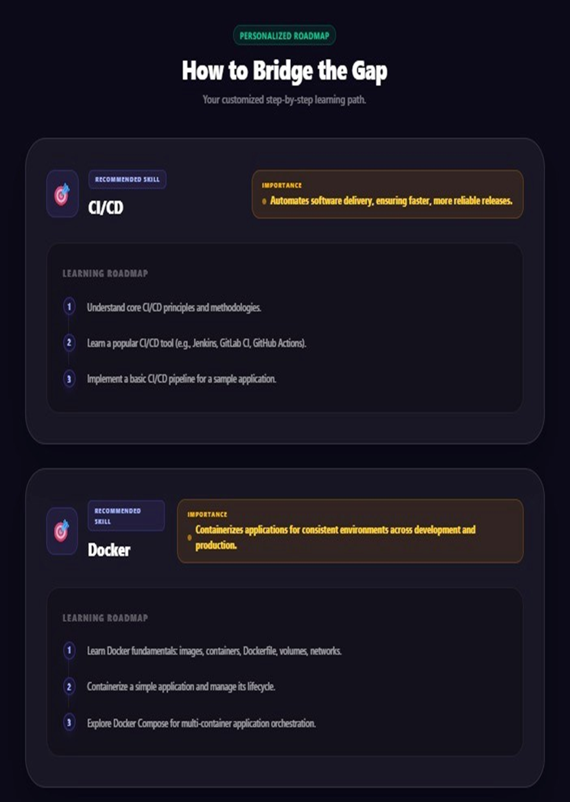
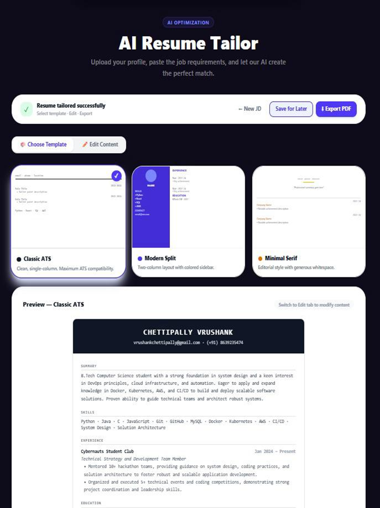

# HireSense – AI-Powered Career Development Platform

<div align="center">

# 🚀 HireSense
### Multi-Agent AI-Driven Platform for Adaptive Career Development


</div>

---

# 📌 Overview

HireSense is an AI-powered career development platform designed to help students and job seekers improve employability through intelligent resume analysis, semantic job matching, skill gap identification, AI-powered resume tailoring, and personalized learning roadmaps.

The platform integrates:
- Large Language Models (LLMs)
- Semantic Matching
- Vector Databases
- AI Agents
- Modern Full-Stack Web Technologies

to deliver a complete AI-driven career readiness ecosystem.

---

# ✨ Key Features

## 🔍 Resume Parsing
- Upload resumes in PDF/DOCX
- Extract:
  - Skills
  - Education
  - Certifications
  - Projects
  - Experience

---

## 📄 Job Description Analysis
- Parse free-form job descriptions
- Identify:
  - Required Skills
  - Keywords
  - Experience Levels
  - Qualifications

---

## 🎯 AI Job-Fit Scoring
- Semantic similarity matching
- Generates:
  - Job-fit percentage
  - Match score
  - Missing skills
  - Strength analysis

---

## 🧠 Skill Gap Analysis
- Detect missing skills
- Suggest targeted improvements
- Prioritize learning requirements

---

## ✍️ AI Resume Tailoring
- ATS-optimized resume generation
- Job-specific keyword optimization
- Intelligent restructuring

---

## 🛣️ Personalized Skill Roadmap
- AI-generated learning pathways
- Recommended:
  - Courses
  - Tutorials
  - Projects
  - Technologies

---

## 📊 Application Tracking Dashboard
- Track applications
- Monitor:
  - Job-fit trends
  - Skill growth
  - Application analytics

---

# 🏛️ System Architecture

The HireSense platform follows a modular multi-agent architecture.

```text
Frontend (Next.js)
       ↓
REST API
       ↓
FastAPI Backend
       ↓
AI Processing Layer
 ├── Resume Parsing Agent
 ├── JD Parsing Agent
 ├── Matching Engine
 ├── Explanation Agent
 ├── Resume Tailoring Agent
 └── Skill Roadmap Agent
       ↓
MongoDB + Pinecone
```

---

# 📊 UML & System Design Diagrams

## 🏛️ System Architecture Diagram

<p align="center">
  
</p>

---

## 🧩 Class Diagram

<p align="center">
  
</p>

### Core Entities

* User
* Resume
* Tailored Resume
* Match Analysis
* Portfolio
* Job Description

---

## 🔄 Activity Diagram

<p align="center">
  
</p>

### Workflow

1. Resume Upload
2. JD Input
3. Resume Parsing
4. JD Parsing
5. Skill Matching
6. Gap Analysis
7. Resume Tailoring
8. Skill Roadmap Generation

---

## 👤 Use Case Diagram

<p align="center">
  
</p>

### Actors

* Job Seeker
* AI Service Engine
* HireSense System

---

## 🔁 Sequence Diagram

<p align="center">
  
</p>

### Flow

* Resume Upload
* JD Submission
* AI Analysis
* Match Computation
* Tailored Resume Generation

---

# 🧩 Tech Stack

| Layer           | Technology                      |
| --------------- | ------------------------------- |
| Frontend        | Next.js 14, React, Tailwind CSS |
| Backend         | FastAPI, Python                 |
| AI/LLM          | Google Gemini 2.5 Flash         |
| Vector Database | Pinecone                        |
| Database        | MongoDB                         |
| Authentication  | JWT                             |
| Resume Parsing  | PyMuPDF, python-docx            |
| Deployment      | Docker                          |
| Version Control | Git & GitHub                    |

---

# ⚙️ Functional Modules

# 1️⃣ User Authentication

* JWT Authentication
* Secure Session Management
* Protected API Routes

---

# 2️⃣ Resume Parsing Agent

Extracts structured information from uploaded resumes using:

* NLP
* Gemini LLM
* PDF/DOCX parsers

---

# 3️⃣ JD Parsing Agent

Processes job descriptions and extracts:

* Skills
* Experience
* Keywords
* Role Information

---

# 4️⃣ Skill Matching Engine

* Computes semantic similarity
* Generates match score
* Detects missing skills

---

# 5️⃣ Explanation Agent

Provides:

* Match explanation
* Personalized suggestions
* Improvement guidance

---

# 6️⃣ Resume Tailoring Agent

Creates ATS-friendly resumes by:

* Reordering sections
* Optimizing keywords
* Enhancing summaries

---

# 7️⃣ Skill Roadmap Agent

Generates:

* Personalized learning plans
* Step-by-step roadmap
* Resource recommendations

---

# 8️⃣ Application Tracking Dashboard

Tracks:

* Applications
* Progress
* Job-fit history
* Skill analytics

---

# 📂 Project Structure

```bash
HireSense/
│
├── frontend/
│   ├── app/
│   ├── components/
│   ├── pages/
│   ├── styles/
│   └── utils/
│
├── backend/
│   ├── api/
│   ├── agents/
│   ├── services/
│   ├── middleware/
│   ├── models/
│   ├── database/
│   └── utils/
│
├── docs/
│   ├── system-architecture.png
│   ├── class-diagram.png
│   ├── activity-diagram.png
│   ├── usecase-diagram.png
│   └── sequence-diagram.png
│
├── tests/
├── docker/
├── requirements.txt
├── package.json
├── docker-compose.yml
└── README.md
```

---

# 🔌 API Endpoints

| Method | Endpoint                 | Description               |
| ------ | ------------------------ | ------------------------- |
| POST   | `/api/auth/register`     | Register user             |
| POST   | `/api/auth/login`        | Login user                |
| POST   | `/api/resume/upload`     | Upload resume             |
| GET    | `/api/resume/{id}`       | Get parsed resume         |
| POST   | `/api/jd/analyze`        | Analyze job description   |
| POST   | `/api/match`             | Compute match score       |
| POST   | `/api/tailor`            | Generate tailored resume  |
| POST   | `/api/roadmap`           | Generate learning roadmap |
| GET    | `/api/applications`      | Fetch applications        |
| POST   | `/api/applications`      | Add application           |
| PUT    | `/api/applications/{id}` | Update application        |

---

# 🧪 Testing

## ✅ Unit Testing

Implemented using:

* pytest
* FastAPI Test Client

### Covered Modules

* Resume Parsing
* JD Parsing
* Matching Engine
* Authentication
* Resume Tailoring

---

## ✅ Integration Testing

Validated:

* Complete job-fit pipeline
* Roadmap generation
* Resume tailoring workflow

---

# 🚀 Installation & Setup

# 1️⃣ Clone Repository

```bash
git clone https://github.com/your-username/hiresense.git
cd hiresense
```

---

# 2️⃣ Frontend Setup

```bash
cd frontend
npm install
npm run dev
```

---

# 3️⃣ Backend Setup

```bash
cd backend
pip install -r requirements.txt
uvicorn main:app --reload
```

---

# 4️⃣ Environment Variables

Create `.env` file:

```env
MONGODB_URI=
PINECONE_API_KEY=
GOOGLE_API_KEY=
JWT_SECRET=
```

---

# 5️⃣ Run with Docker

```bash
docker-compose up --build
```

---

# 📈 Future Scope

## 🔹 AI Mock Interviews

* AI-generated interview questions
* Answer evaluation
* Interview coaching

---

## 🔹 Real-Time Job Market Intelligence

* LinkedIn API Integration
* Naukri API Integration
* Trending skills analysis

---

## 🔹 Employer Dashboard

* Recruiter-side analytics
* Candidate assessment reports

---

## 🔹 Cloud Deployment

* AWS / GCP / Azure deployment
* CI/CD pipelines
* Kubernetes orchestration

---

# 🎯 Project Objectives

* Improve candidate-job matching
* Provide personalized career guidance
* Generate adaptive learning pathways
* Increase ATS compatibility
* Enhance career readiness

---

# 👨‍💻 Team Members

| Name           | Roll Number |
| -------------- | ----------- |
| G.A. Abhisht   | 23B81A05HJ  |
| C. Vrushank    | 23B81A05KV  |
| G. Rohan Reddy | 23B81A05JN  |

---

# 🎓 Academic Details

### Department of Computer Science and Engineering

### CVR College of Engineering

### Hyderabad, Telangana

Guided By:
**Dr. Ch. Sarada**
Associate Professor, Department of CSE

---

# 📸 Project Outputs

## 📄 Resume Parsing Output

<p align="center">
  
</p>

---

## 📊 Match Analysis Output

<p align="center">
  
</p>

---

## 🛣️ Skill Roadmap Output

<p align="center">
  
</p>

---

## ✍️ Tailored Resume Output

<p align="center">
  
</p>

---

# 📚 References

1. Resume Parsing and Candidate Ranking Systems
2. Semantic Similarity using Transformer Embeddings
3. Multi-Agent Frameworks for LLM Applications
4. Personalized Skill Gap Analysis using LLMs

---

# 📜 License

This project is developed for academic and educational purposes.

---

# ⭐ Acknowledgement

We sincerely thank:

* CVR College of Engineering
* Department of CSE
* Faculty Members
* Project Guide

for their support and guidance throughout the development of HireSense.

---

<div align="center">

# 🌟 HireSense — Empowering Careers with AI 🌟

Made using AI + Full Stack Technologies

</div>